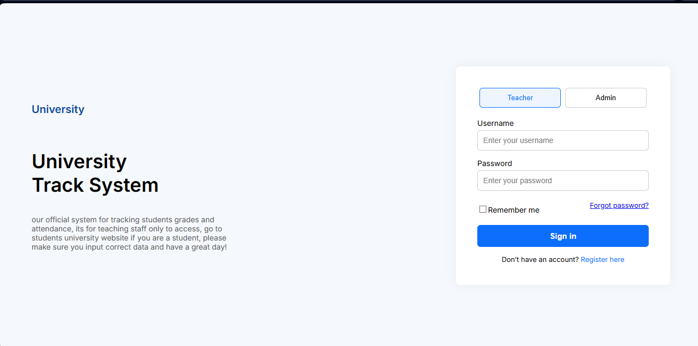
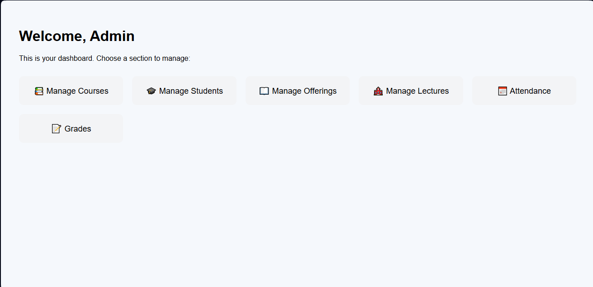
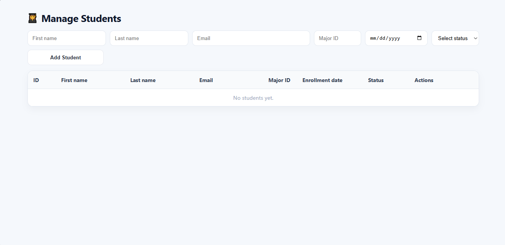
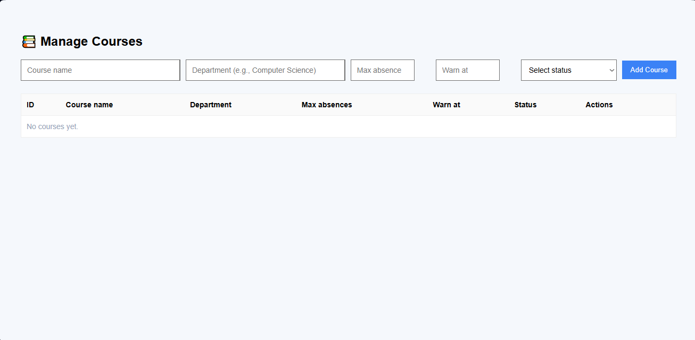
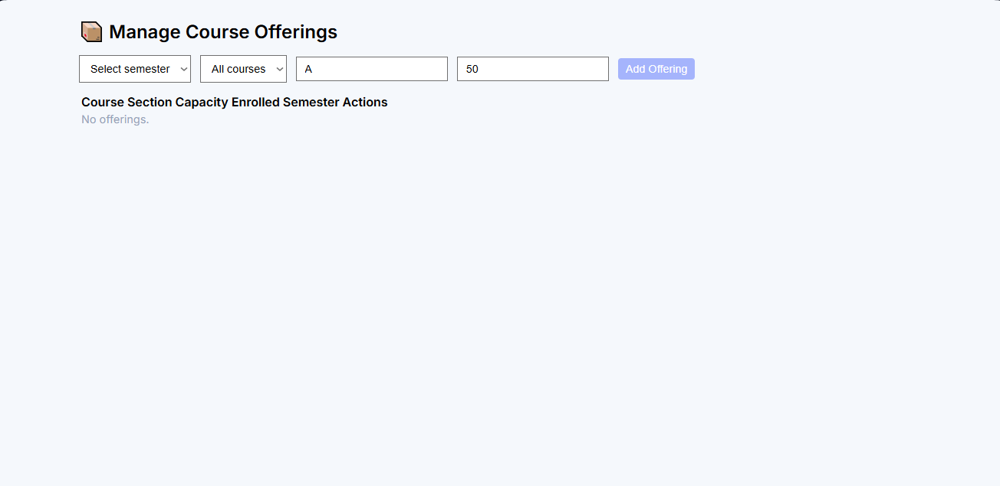
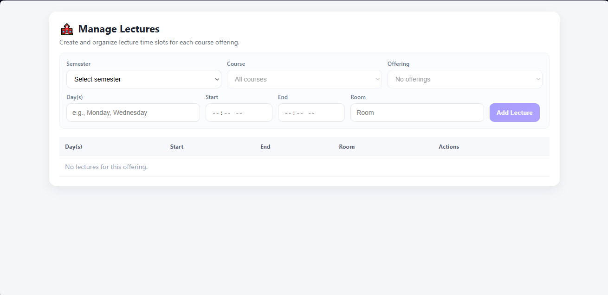
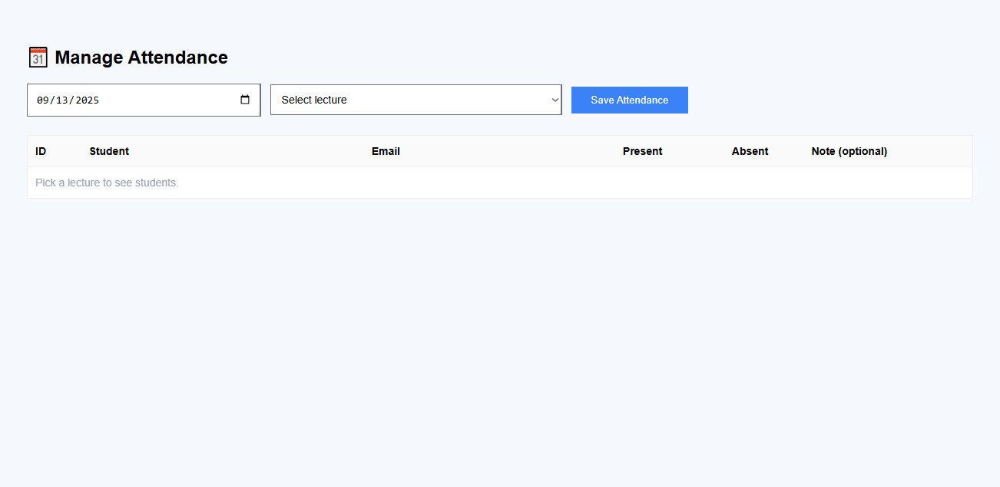
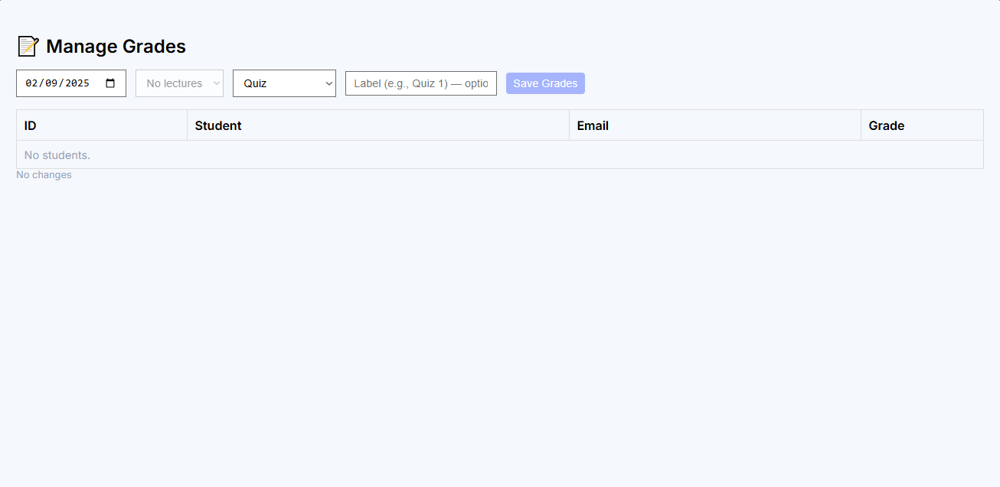

# 🏫 University Tracking System
**Stack:** React, JavaScript, CSS, MySQL, Node.js | **Type:** Full-stack web app  

> ⚠️ **Note:** This project is still under construction. New edits and improvements will be pushed regularly.  

---

## ✨ What it does
Manage courses, student attendance and grades, generate performance reports, and send automated notifications.  

---

## 🔩 Key features
- Create new courses and edit existing ones  
- Manage students and their info  
- Attendance and grade records  
- Performance reports and automated notifications  
- **CSV import system** for bulk attendance uploads  
- **Automated email alerts** when attendance is taken  
- Relational database (MySQL) for integrity and constraints  

---

## 🖼️ Screens
  
  
  
  
  
  
  
  

---
## 🛠 Requirements
- Node.js (v16+ recommended)
- Visual Studio Code
- MySQL Server & MySQL Workbench  
- npm (comes with Node.js)  

---
## 🚀 Getting Started

### 1) Clone
```bash
git clone https://github.com/razanserreih/uni-tracker.git
cd uni-tracker
```

### 1. Setup the database
- Install MySQL Workbench.
- Download the .sql file from [here](docs/uni_track_system.sql)

### 2. Run the backend
- Right-Click the attendance_backend folder in vs and click Open in integrated terminal Then Write:
```bash
cd attendance_backend
npm install
npm start
```

### 3. Run the frontend
- Right-Click the forntend folder in vs and click Open in integrated terminal Then Write: 
```bash
cd frontend
npm install
npm start
```

---

📩 That’s all! If you have any questions or feedback, feel free to reach out to me at [Razanserreih03@gmail.com](mailto:Razanserreih03@gmail.com).
